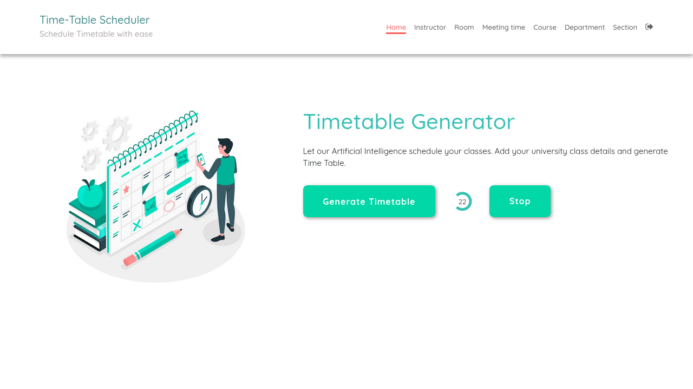
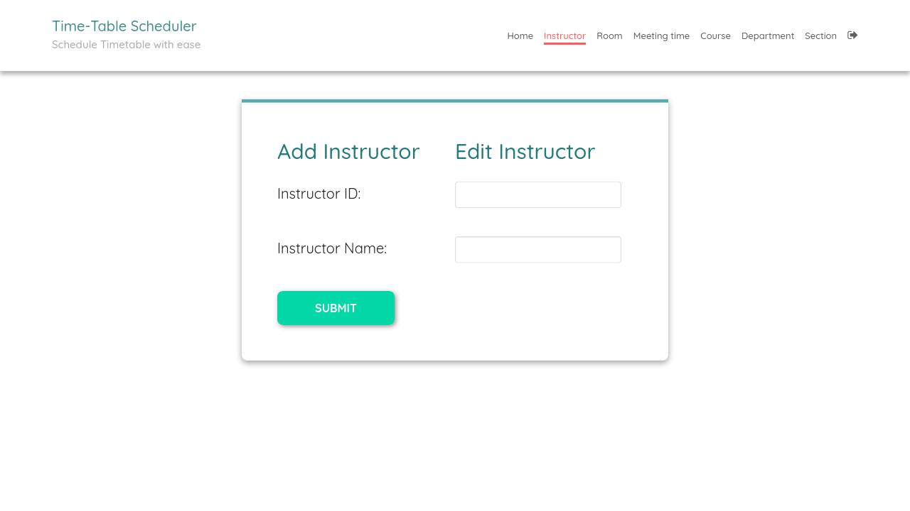
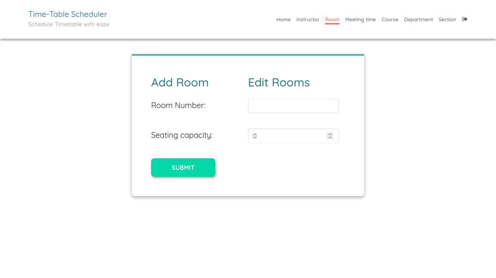
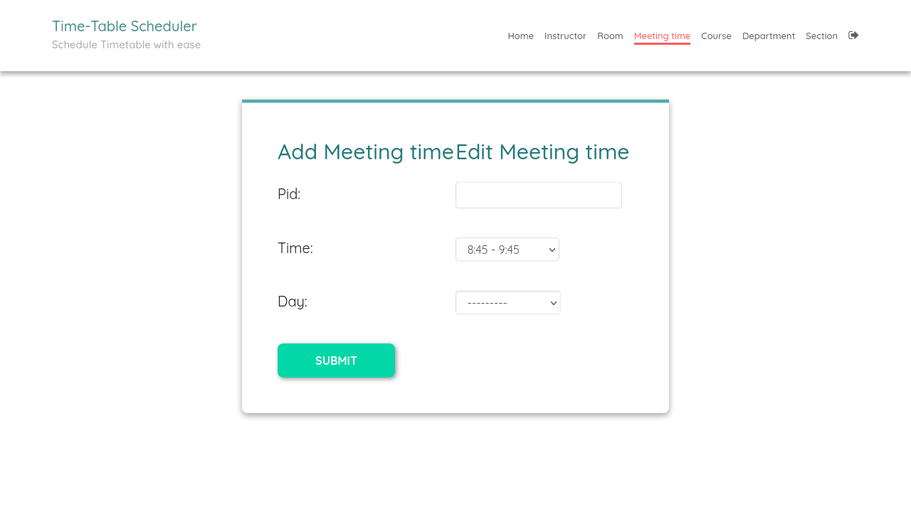
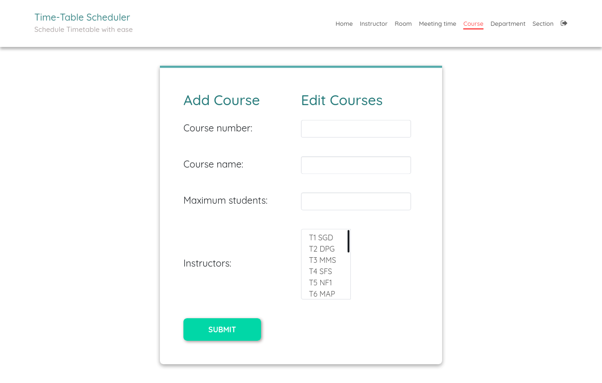
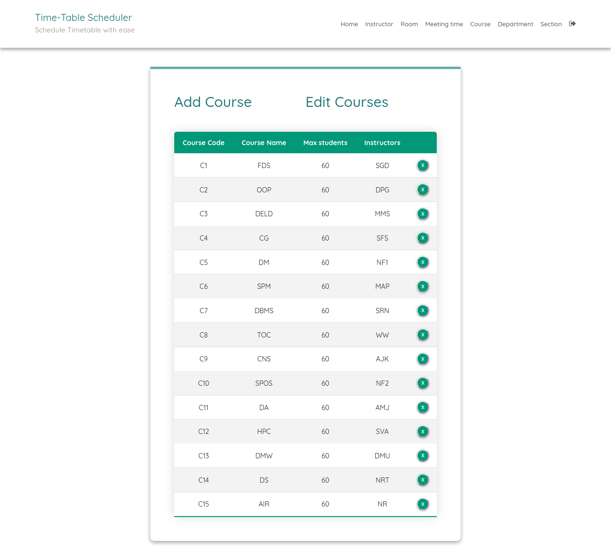
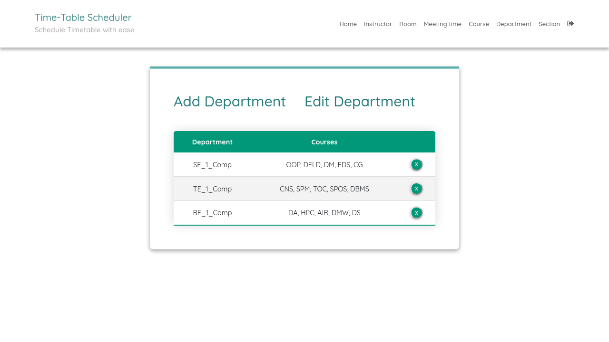
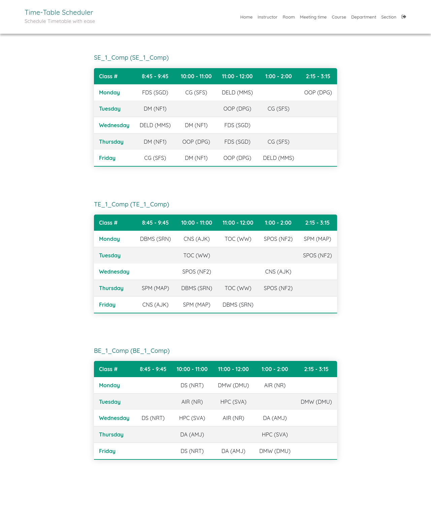

# Timetable Scheduler - Intelligent University Timetable Generator


> An AI-enhanced, intelligent timetable generation system using **Genetic Algorithms** with **Machine Learning** for faculty preference optimization.

---

## Table of Contents

1. [Project Overview](#project-overview)
2. [Technology Stack](#technology-stack)
3. [Core Features](#core-features)
4. [UI Enhancement Features (10 Tasks)](#ui-enhancement-features-10-tasks)
5. [Database Models](#database-models)
6. [Genetic Algorithm Implementation](#genetic-algorithm-implementation)
7. [ML/AI Preference Learning](#mlai-preference-learning)
8. [Installation Guide](#installation-guide)
9. [API Endpoints](#api-endpoints)
10. [Screenshots](#screenshots)
11. [Project Structure](#project-structure)

---

## Project Overview

The **Timetable Scheduler** is a comprehensive web-based solution for automating university timetable generation. It combines evolutionary computing (Genetic Algorithms) with modern UI/UX design and machine learning to create optimized schedules that satisfy both hard constraints (room capacity, no double-booking) and soft constraints (faculty preferences, course distribution).

### Key Highlights
- ✅ **Automated Generation**: Uses Genetic Algorithm for optimization
- ✅ **Conflict Detection**: Real-time validation and highlighting
- ✅ **AI Suggestions**: ML-based time slot recommendations
- ✅ **Batch Operations**: Select and modify multiple entries
- ✅ **Visual Analytics**: Preference heatmaps and dashboards
- ✅ **Export/Import**: CSV export and data portability

---

## Technology Stack

### Backend
| Component | Technology | Purpose |
|-----------|-----------|---------|
| **Framework** | Django 4.x | Web application framework |
| **Language** | Python 3.9+ | Core programming |
| **Database** | SQLite / PostgreSQL | Data persistence |
| **Algorithm** | Genetic Algorithm | Schedule optimization |
| **ML/AI** | scikit-learn, pandas, numpy | Preference prediction |
| **Testing** | Django Test Framework | Unit testing |

### Frontend
| Component | Technology | Purpose |
|-----------|-----------|---------|
| **Templating** | Django Templates | Server-side rendering |
| **Styling** | CSS3 + Custom CSS | Responsive UI |
| **Interactivity** | Vanilla JavaScript | Dynamic behavior |
| **Icons** | Emoji + CSS Icons | Visual indicators |

### Python Dependencies
```
Django>=4.0
scikit-learn>=1.0
pandas>=1.3
numpy>=1.21
joblib>=1.0
```

---

## Core Features

### 1. Genetic Algorithm Optimization
- **Population Size**: 100 schedules per generation
- **Selection**: Tournament selection (k=5)
- **Crossover**: Single-point with 90% rate
- **Mutation**: Adaptive mutation (1% base rate)
- **Elitism**: Top 10% preserved across generations
- **Termination**: Max 1000 generations or fitness threshold

### 2. Constraint Satisfaction

#### Hard Constraints (Must Satisfy)
| Constraint | Description |
|------------|-------------|
| No Room Double-Booking | Each room can host only one class at a time |
| No Instructor Double-Booking | Faculty cannot teach two classes simultaneously |
| Room Capacity | Room capacity >= enrolled students |
| Equipment Match | Labs only in computer-equipped rooms |
| Prerequisite Order | Prerequisites scheduled before dependent courses |

#### Soft Constraints (Optimized)
| Constraint | Description |
|------------|-------------|
| Faculty Preferences | Preferred days/time slots |
| Even Distribution | Courses spread across the week |
| Minimize Gaps | Reduce idle periods for students |
| Back-to-back Limit | Avoid excessive consecutive classes |

### 3. Entity Management
- **Rooms**: Add/edit rooms with capacity and equipment
- **Instructors**: Manage faculty with department assignment
- **Courses**: Course catalog with credits and requirements
- **Departments**: Organizational structure
- **Sections**: Course-instructor-time-room linking
- **Meeting Times**: Time slot definitions

---

## UI Enhancement Features (10 Tasks)

### Task 1: Conflict Visual Indicators
- Red border highlighting on conflicting entries
- ⚠️ Warning icon badge
- Hover tooltip with conflict details
- Real-time conflict detection

### Task 2: Lock/Unlock Toggle Buttons
- 🔒 Lock individual entries
- 🔓 Unlock when needed
- Locked entries excluded from auto-fix
- Visual lock indicator on entries

### Task 3: Conflict Alert Panel
- Top banner with conflict count
- Severity-based color coding (Red/Orange/Yellow)
- "Auto-Fix All" button
- Dismissible alerts
- Links to detailed conflict log

### Task 4: Suggestion Sidebar
- Slide-out panel from right
- AI-generated alternative suggestions
- Preference-based slot rankings
- One-click apply suggestion
- Confidence scores displayed

### Task 5: Enhanced Entry Detail Modal
- Popup modal on entry click
- Full details: Section, Course, Instructor, Room, Time
- Conflict status and history
- Quick actions: Edit, Delete, Resolve
- Suggestions list

### Task 6: Dashboard Widgets
- 📊 Total Classes widget
- ⚠️ Conflicts Detected widget
- 📅 Today's Schedule widget
- 🎯 Quick Actions widget
- 📈 Last Generated info
- Live data updates

### Task 7: Filter & Search Bar
- 🔍 Search by course/faculty name
- 📅 Filter by day (Mon-Fri)
- 🏷️ Filter by entry type (Manual/Auto/Hybrid)
- ⚡ Filter by status (Conflict/Locked/OK)
- Clear filters button
- Results counter

### Task 8: Conflict Log Page
- Complete conflict history
- Filters: Status, Type, Severity, Date
- Stats: Total/Resolved/Pending
- Action buttons per conflict
- Export conflict reports

### Task 9: Preference Heatmap View
- Visual heatmap (Days × Time Slots)
- Color-coded scores:
  - 🟢 Green: Excellent (0.8-1.0)
  - 🟡 Light Green: Good (0.6-0.8)
  - 🟠 Orange: Neutral (0.4-0.6)
  - 🔴 Red: Poor (0.0-0.4)
- Instructor selector
- Average score display
- Best slot identification

### Task 10: Batch Action Toolbar
- ☑️ Checkboxes on each entry
- Floating toolbar when selected
- **Actions**:
  - ☑️ Select All
  - 🔒 Batch Lock
  - 🔓 Batch Unlock
  - ✅ Batch Resolve
  - 🗑️ Batch Delete
  - 📤 Export CSV
  - ❌ Clear Selection

---

## Database Models

### Core Models (12+ Tables)

#### 1. Room
```python
r_number, seating_capacity, has_projector, has_computers, room_type
```

#### 2. Instructor
```python
uid, name, email, department, preferred_days, unavailable_slots
```

#### 3. Course
```python
course_number, course_name, department, max_numb_students, 
credit_hours, course_type, requires_lab
```

#### 4. MeetingTime
```python
pid, time, day, duration_minutes
```

#### 5. Department
```python
dept_name, building, head_instructor
```

#### 6. Section
```python
section_id, department, num_class_in_week, course, 
instructor, meeting_time, room, semester, year
```

### AI/ML Models

#### 7. TimetableEntry (Enhanced)
```python
entry_id, section, course, instructor, room, meeting_time,
is_locked, has_conflict, entry_type, preference_score, confidence_score
```

#### 8. ConflictLog
```python
entry, conflict_type, severity, description, detected_at, 
resolved_at, status, resolution_action
```

#### 9. HistoricalTimetableData
```python
section, instructor, course, room, meeting_time, 
was_successful, preference_score, conflict_occurred
```

#### 10. FacultyPreference
```python
instructor, day_of_week, time_slot, preference_score, weight, source
```

#### 11. MLModelMetadata
```python
model_name, model_type, version, accuracy, precision, 
recall, f1_score, training_data_count
```

#### 12. GenerationLog
```python
timestamp, user, parameters, best_fitness, 
number_of_conflicts, execution_time_seconds
```

---

## Genetic Algorithm Implementation

### Algorithm Flow
```
1. INITIALIZE Population (100 random schedules)
2. EVALUATE Fitness for each schedule
3. WHILE (not converged) DO:
   a. SELECT parents (Tournament selection)
   b. CROSSOVER (Single-point, 90% rate)
   c. MUTATE (Swap mutation, 1% rate)
   d. EVALUATE new population
   e. ELITISM (Keep top 10%)
4. RETURN Best Schedule
```

### Fitness Function
```python
Fitness = 1 / (1 + HardConflicts*100 + SoftViolations*10 - PreferenceBonus*0.5)
```

### Key Parameters
- **Population**: 100
- **Generations**: 1000 max
- **Mutation Rate**: 0.01
- **Crossover Rate**: 0.9
- **Elitism**: 10 individuals

---

## ML/AI Preference Learning

### Model: Random Forest Regressor
```python
Input Features:
├── Instructor (encoded)
├── Day of Week (0-4)
├── Time Slot Index
├── Course Type
├── Historical Satisfaction
└── Previous Success Rate

Output: Preference Score (0.0 - 1.0)
```

### Training Pipeline
1. Collect historical schedule data
2. Feature engineering
3. Train/test split (80/20)
4. Cross-validation (k=5)
5. Model persistence with joblib

### Usage
- Generate preference heatmaps
- Rank alternative slots
- Optimize for faculty satisfaction

---

## Installation Guide

### Prerequisites
- Python 3.9 or higher
- pip package manager
- 2GB RAM minimum
- 500MB disk space

### Step-by-Step Installation

```bash
# 1. Clone the repository
git clone https://github.com/Priyans24hu/Timetable-Scheduler-.git
cd Timetable-Scheduler-master

# 2. Create virtual environment
python -m venv venv

# 3. Activate virtual environment
# On Windows:
venv\Scripts\activate
# On Linux/Mac:
source venv/bin/activate

# 4. Install dependencies
pip install -r requirements.txt

# 5. Run database migrations
python manage.py migrate

# 6. Create superuser account
python manage.py createsuperuser
# Enter username, email, password when prompted

# 7. Run the development server
python manage.py runserver

# 8. Access the application
# Open browser and go to: http://127.0.0.1:8000/
```

### Default Login Credentials
```
Admin Account:
  Username: admin
  Password: admin123

Test User Account:
  Username: testuser
  Password: testpass
```

---

## API Endpoints

### Intelligent Editing APIs
| Endpoint | Method | Description |
|----------|--------|-------------|
| `/api/conflict-summary` | GET | Get conflict statistics |
| `/api/validate-all/` | POST | Validate entire timetable |
| `/api/auto-fix` | POST | Auto-resolve conflicts |
| `/api/suggest` | GET | Get AI suggestions |
| `/api/quick-fix/<id>/` | POST | Fix specific entry |
| `/api/toggle-lock/<id>/` | POST | Lock/unlock entry |

### Batch Action APIs
| Endpoint | Method | Description |
|----------|--------|-------------|
| `/api/batch-lock/` | POST | Lock multiple entries |
| `/api/batch-delete/` | POST | Delete multiple entries |
| `/api/batch-resolve/` | POST | Resolve multiple conflicts |
| `/api/export-entries/` | GET | Export as CSV |

### Preference APIs
| Endpoint | Method | Description |
|----------|--------|-------------|
| `/api/preference-heatmap/` | GET | Get heatmap data |
| `/api/train-model/` | POST | Train ML model |

---

## Screenshots

### Dashboard View (Task 6)
[](#)

### Timetable with Conflicts (Tasks 1-3, 7, 10)
[](#)

### Conflict Log Page (Task 8)
[](#)

### Preference Heatmap (Task 9)
[](#)

### Entry Detail Modal (Task 5)
[](#)

### Suggestion Sidebar (Task 4)
[](#)

### Batch Action Toolbar (Task 10)
[](#)

### Entity Management
[](#)

---

## Project Structure

```
TimetableScheduler-master/
├── SchedulerApp/                    # Main Django Application
│   ├── models.py                    # 12+ Database models
│   ├── views.py                     # Views & GA implementation
│   ├── urls.py                      # URL routing
│   ├── admin.py                     # Admin configurations
│   ├── forms.py                     # Django forms
│   ├── services/                    # Service layer
│   │   ├── constraint_engine.py     # Hard/soft constraint validation
│   │   ├── suggestion_engine.py     # AI suggestions
│   │   ├── preference_model.py      # ML model training
│   │   └── preference_integration.py
│   └── tests.py                     # Unit tests
├── templates/                       # HTML Templates
│   ├── base.html                    # Base layout
│   ├── index.html                   # Dashboard (Task 6)
│   ├── timetable_stored.html        # Main timetable
│   ├── conflict_log.html            # Conflict log (Task 8)
│   ├── preference_heatmap.html      # Heatmap (Task 9)
│   └── *.html                       # Entity templates
├── static/                          # Static files (CSS/JS)
├── manage.py                        # Django management
├── requirements.txt                 # Dependencies
└── README.md                        # This file
```

---

## Key Features Summary

| Feature | Status | Description |
|---------|--------|-------------|
| Genetic Algorithm | ✅ | Population-based optimization |
| Conflict Detection | ✅ | Real-time validation |
| Lock/Unlock | ✅ | Entry protection |
| Suggestion Engine | ✅ | AI-based alternatives |
| Batch Operations | ✅ | Multi-select actions |
| Preference Heatmap | ✅ | Visual preference grid |
| Dashboard | ✅ | Statistics widgets |
| Filtering | ✅ | Search & filters |
| Conflict Log | ✅ | History tracking |
| Export | ✅ | CSV export |

---

## Future Enhancements

- 📱 **Mobile App**: React Native companion
- 📧 **Email Notifications**: Schedule change alerts
- 📅 **Calendar Export**: iCal/Outlook integration
- 🔄 **Real-time Collaboration**: WebSocket-based
- 🧠 **Deep Learning**: Neural network optimization
- 🌍 **Multi-Campus**: Distributed scheduling

---

## License

This project is developed for educational purposes.

---

## Contact & Support

**Developer**: [Your Name]  
**Email**: [Your Email]  
**Institution**: [Your College/University]  
**Project URL**: https://github.com/Priyans24hu/Timetable-Scheduler-.git

---

**Last Updated**: April 2026  
**Version**: 2.0 (All 10 UI Tasks Complete + AI Features)  
**Status**: Production Ready ✅

---

## Quick Start for Viva

### For Project Presentation:

1. **Start the server**: `python manage.py runserver`
2. **Open browser**: `http://127.0.0.1:8000/`
3. **Login**: Use admin/admin123
4. **Navigate**:
   - Dashboard: Home page with widgets
   - Timetable: `/timetable/stored/`
   - Conflict Log: `/conflict-log/`
   - Heatmap: `/preference-heatmap/`

### Key Talking Points:
1. **GA Explanation**: Population → Selection → Crossover → Mutation
2. **Constraints**: Hard (must satisfy) vs Soft (optimize)
3. **ML Integration**: Preference learning from historical data
4. **UI Features**: 10 enhancement tasks completed
5. **Batch Operations**: Select multiple → Apply action

